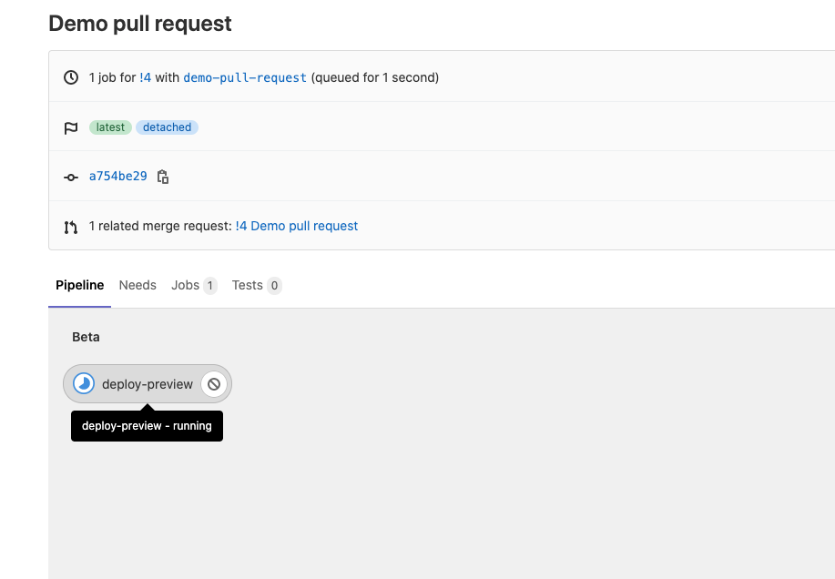
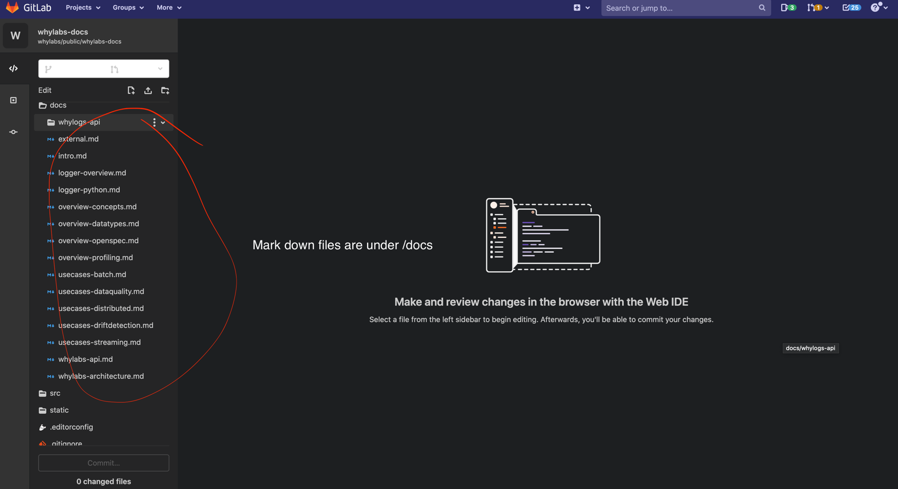
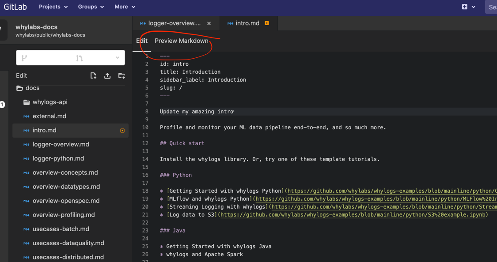
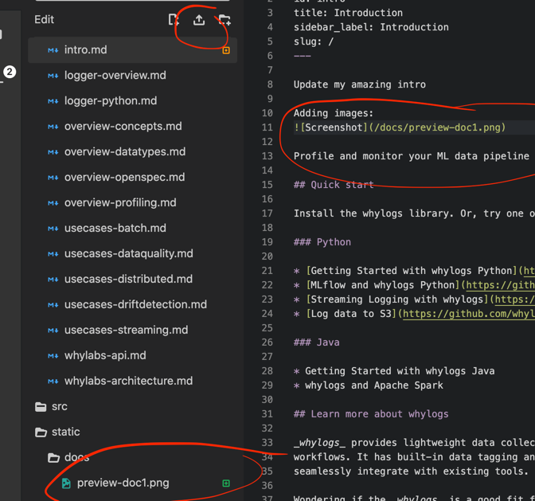
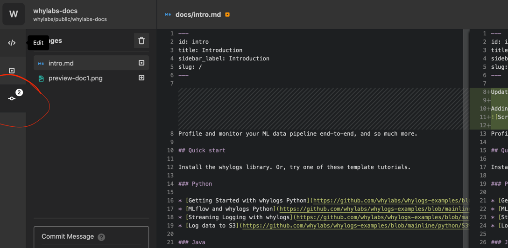
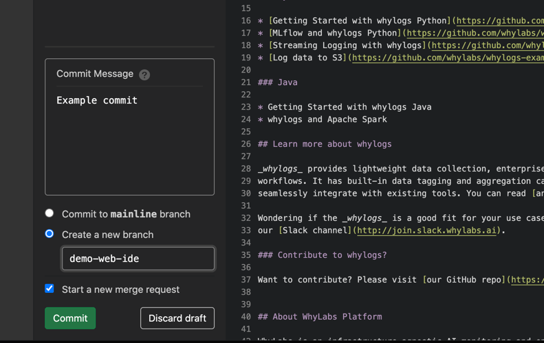
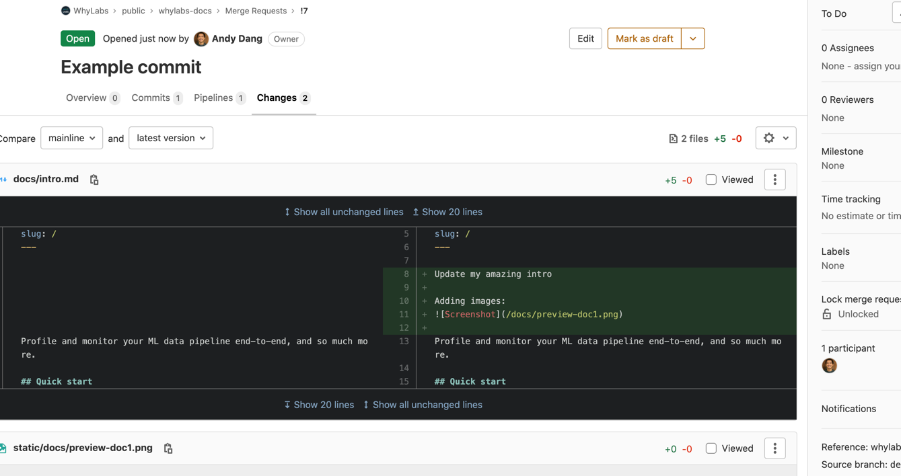
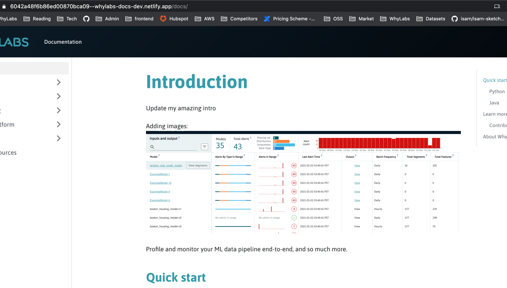

# WhyLabs documentation

This repository contains WhyLabs's documentation.

This website is built using [Docusaurus 2](https://v2.docusaurus.io/), a modern static website generator.

Fully formatted documents can be viewed at http://docs.whylabs.ai/docs/.

To contribute, please follow these steps:

[[_TOC_]]


## Git-based Workflow
* Useful if you want to preview content locally and make styling changes

### Requirements

- Git CLI
- [Node.js](https://nodejs.org/en/download/) version >= 12.13.0 or above (which can be checked by running `node -v`).
  You can use [nvm](https://github.com/nvm-sh/nvm) for managing multiple Node versions on a single machine installed
- [Yarn](https://yarnpkg.com/en/) version >= 1.5 (which can be checked by running `yarn --version`). Yarn is a
  performant package manager for JavaScript and replaces the `npm` client.
- fswatch via `brew install fswatch`.

### Clone and branching

* Check out and create your local branch
```
git clone git@gitlab.com:whylabs/public/whylabs-docs.git
cd whylabs-docs
yarn install
git checkout -b docs-your-edit
```

### Make your edits

* Please make your local edits
  


* You can test the local version with:

```
yarn start
```

This command starts a local development server and open up a browser window. Most changes are reflected live without
having to restart the server.

### Build

* Docusaurus will fail if there are broken links in the documentation (even though it will run the preview fine)
* To test the Docusaurus build, run

```console
yarn build
```

### Commit

* You'll need to commit your local branch first using Git


* You'll need to push the branch back to GitLab to create a pull request

```console
git push --set-upstream original <your-branch-name>
```

* GitLab will then prompt you with a link to create the pull request
  


* Then you can fill out the information for the pull request. You should select yourself as "Assignee" and add appropriate reviewers.
You can add multiple reviewers:
  


* Once you create a merge request, you should see it in
  GitLab: [merge requests](https://gitlab.com/whylabs/public/whylabs-docs/-/merge_requests)

### Verify the merge request
* Once submitted, GitLab will kick off a build preview. You can see it in the merge request page:


  
* If everything goes well, the preview step will succeed. You can view the preview log by clicking on the link:



* Once passed, you can click on the link to get the **preview website**


* At the bottom of the preview log, you should see a website link like this:


* You can visit the website to check out the preview draft site:
  
```
https://<unique-id>-whylabs-docs-dev.netlify.app
```

* As a reviewer, you should do your due diligence as well by following these steps!

### Deployment

* Once merged, the changes will flow through the [pipeline](https://gitlab.com/whylabs/public/whylabs-docs/-/pipelines).
* You should see a merge pipeline like this with three steps (build, beta, prod)


* Please check out the beta preview link before deploying to Prod: https://whylabs-docs-dev.netlify.app/


* Clicking on "Passed" button should take you to the detailed pipeline. If you have the right permission, you should see the
"Play" button next to `deploy-prod`. Using this you can deploy the final version to production


  
## Browser-based Workflow

* Navigate to the [docs](https://gitlab.com/whylabs/public/whylabs-docs/-/tree/mainline/docs) directory in GitLab. You'll
  find the Web IDE button in the top right corner
  
  

* Clicking this should take you to a browser-based IDE

  

* Select the markdown file and make the edit. 
  
  

* You should be able to click "Preview Markdown" for seeing changes

  

* You can also upload images to the *static* folder, which maps to `/` of the site. THen you should be able to link to
  it in the markdown documentation. It's recommended that you add the document slug as the prefix for the image
  
  

* Once you're  ready, you and review the changes here
  
  
* If you're happy with the change, you can create a branch with a commit, and kick off a merge request

  

* You should be able to double check the diff in the "Changes" tab of the PR:
   
  
* The merge request should spit out a draft URL in the log (see the navigation from Merge request -> build log) in the Git
workflow above. Make sure you add **/docs** to the URL
   
  
* The preview site should give you a rendering with your changes like [this link](https://6042a48f6b86ed00870bca09--whylabs-docs-dev.netlify.app/):
  

# Diagrams
We use plantuml to create diagrams. It's a diagram DSL that lets you version control your diagrams and generate them consistently across different authors. We bundle a version of the plantuml jar along with the repo. You'll need to install `fswatch` with `brew install fswatch` in order to get the server working in `yarn start`.

The easiest way to make a new diagram is to fork one of the existing ones and check out the plantuml documentation online. They have pages on each type of diagram that you can make. You'll probably mostly be creating [sequence](https://plantuml.com/sequence-diagram) and [class](https://plantuml.com/class-diagram) diagrams, but they do have more.

To include your diagrams, you'll reference them as images in the location that they're hardcoded to be generated into, like this:

```markdown
<div style={{textAlign: 'center'}}>


</div>
```

The empty space in between the div and the markdown include is apparently important.